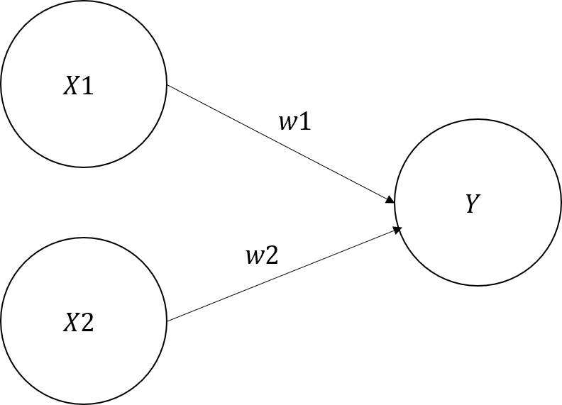
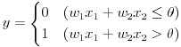

# 퍼셉트론 알고리즘
Perceptron 알고리즘은 프랑크 로젠블라트가 1957년에 고안한 알고리즘으로, 퍼셉트론은 인공 뉴런을 의미한다.

퍼셉트론은 다수의 신호를 입력으로 받아 하나의 신호를 출력한다.

여기서 신호란, 전류나 강물처럼 하나의 흐름(Flow)가 있는 것으로 생각하면 좋다.

퍼셉트론은 신호를 받아 흐른다/안흐른다(1/0)의 두 가지 값을 가질 수 있다.

위 그림에서 각 원은 하나의 뉴런, 노드를 의미하며, 각 뉴런의 신호가 다음 계층의 뉴런으로 전달될 때 고유의 가중치(weight)가 곱해지게 된다.

이전 계층에서 전달된 신호의 총합이 정해진 한계를 넘어설 때만 Y는 1을 출력합니다. 이 한계값을 임계값이라 하며, θ로 나타낸다.

퍼셉트론은 복수의 입력 신호에 각각의 고유한 가중치를 부여하므로, 가중치는 각 신호가 결과에 주는 영향력을 주는 요소로 작용한다.

즉, 가중치가 클수록 해당 신호가 더 중요함을 뜻한다.

예를들어, OR 게이트의 매개변수를 설정하려면, w1과 w2를 각각 0.2, θ를 0.1로 하면 된다.

이러한 가중치를 컴퓨터가 스스로 정할 수 있도록 한 것이 기계학습이라 할 수 있다.