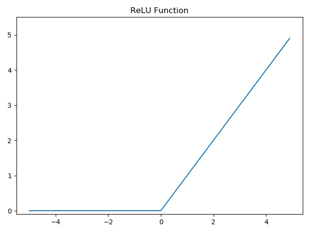
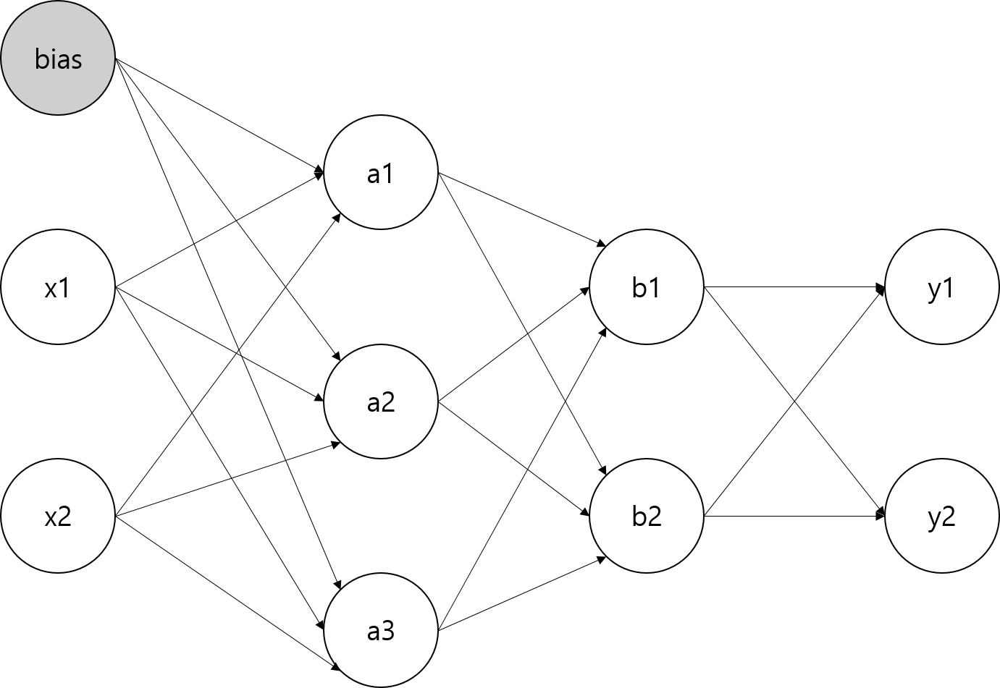
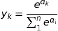
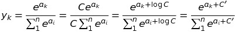

# 신경망 개요
퍼셉트론 알고리즘을 활용하면 이론상 모든 컴퓨터의 기능을 구현할 수 있지만, 이를 위한 가중치를 개발자가 일일히 지정해줘야 하는 큰 단점이 있었다.

신경망에서는, 이 단점을 보완하기 위해 컴퓨터가 데이터로부터 자동으로 이러한 가중치를 구한다.

신경망은 입력층, 은닉층, 출력층으로 이루어지는데, 개발자는 이 중 입력층과 출력층만을 보고 조작할 수 있다.

## 활성화 함수
활성화 함수(Activation Function)은 입력 신호의 총합이 활성화를 일으키는지 정하는 역할을 한다. 이 활성화 함수는 전에 배운 퍼셉트론의 식과 유사하게 아래처럼 나타낼 수 있다.

`h(x) = b + w1x1 + w2x2`

이러한 활성화 함수는 임계값을 경계로 출력이 바뀌는데, 이를 계단 함수(step function)이라 한다.

위 함수에서는 활성화 함수를 계단 함수로 사용했지만, 활성화 함수를 다른 함수로 구현할 수도 있는데, 이것이 신경망의 기본 원리이다.

### 시그모이드 함수
다음은 신경망에서 자주 사용하는 활성화 함수인 시그모이드 함수(Sigmoid Function)이다.

### 계단 함수와 시그모이드 함수 비교

특정값에서 급작스럽게 값이 변하는 계단 함수와 달리, 시그모이드 함수는 그 이름대로 S자의 함수를 형성한다.

또한, 계단 함수가 0과 1만을 출력하는 것에 비해, 시그모이드 함수는 0에서 1사이의 연속되는 실수를 리턴값으로 가진다.

퍼셉트론에서 0,1이 흘렀다면, 신경망에서는 연속적인 실수가 흐르는 것이다.

### 비선형 함수
함수를 논할 때 선형 함수와 비선형 함수라는 용어가 등장한다.
선형 함수는 `y=ax + b`와 같이 기울기가 일정한 함수이며, 비선형 함수는 기울기가 일정하지 않은 함수이다.

신경망에서 활성화 함수는 비선형 함수를 써야한다. 그렇지 않으면 신경망의 계층을 깊게 하는 의미가 없어지기 때문이다.

선형 함수로 구성된 3층 퍼셉트론을 생각해보자.
`h(x) = cx`를 활성화 함수로 한다고 했을때, 결과는 `y=h(h(h(x)))`가 될 것이다.
이는 결국 a가 c의 3승인 `y=ax`와 같다.

여러 계층의 이점을 얻으려면, 반드시 비선형 함수를 활성화 함수로 써야하는 것이다.

### ReLU 함수
시그모이드 함수외에도 최근 신경망에 자주 사용되는 함수로 ReLU 함수(Rectified Linier Unit)가 있다.

ReLU함수는 0이하의 값은 0을 리턴하고, 이외의 값은 그대로 리턴하는 함수로 아래와 같다.

## 넘파이의 다차원 배열
다차원 배열 계산을 숙달하면 신경망을 효율적으로 개발할 수 있다.

이와 관련해, 넘파이의 다차원 행렬 계산 코드를 matrix with numpy 디렉토리에 저장해두었다.

## 신경망에서의 행렬 곱
다음 신경망을 행렬로 구현해보자.

X는 2, W는 2x3, Y는 3으로 행렬곱이 가능하다.

~~~python
import numpy as np
X = np.array([1,2])
W = np.array([[1,3,5],[2,4,6]])

Y = np.dot(X,W)
~~~

다차원 배열의 스칼라곱을 구하는 np.dot을 활용하면 Y의 원소가 몇개든 쉽게 계산할 수 있다.

## 실습: 3층 신경망 구현하기
이제 넘파이를 통해 아래의 3층 신경망을 구현해보자.

이는 Multi-Layer_Neural_Network.py 에 구현하면서 설명했다.

텐서의 dot연산을 활용하여 위 순방향 신경망을 쉽게 구현할 수 있다.

## 출력층 설계하기 : 분류와 회귀
신경망은 분류와 회귀에 모두 이용할 수 있다. 일반적으로 회귀에는 항등 함수를, 분류에는 소프트맥스 함수를 사용한다.

항등 함수는 입력을 그대로 출력한다. 굳이 구현하자면 아래와 같다.
~~~python
def identityFunction(x):
    return x
~~~
한편, 분류에서 사용하는 소프트맥스 함수는 다음 식을 가진다.

n은 출력층의 뉴런 수, y는 그 중 k번째 뉴런의 출력을 뜻한다.

식과 같이 소프트맥수 함수의 분자는 입력신호 a의 지수 함수, 분모는 모든 입력신호의 지수 함수의 합으로 구성된다.

~~~python
def softmax(a):
    exp_a = np.exp(a)
    sum_exp_a = np.sum(exp_a)
    y = exp_a / sum_exp_a
    return y
~~~

위 코드는 소프트맥스 함수를 잘 수행하지만, 지수 함수의 특성상 실제 환경에서 오버 플로우의 위험이 있다.
이를 방지하기 위해 아래와 같이 소프트맥스 함수를 고쳐보자.

위 식은 소프트맥스 함수를 계산할 때, 어떤 정수를 더하거나 빼도 결과는 바뀌지 않는다는 것이다.
오버플로를 막기 위해 위 지식을 활용하여, 소프트맥스 함수를 구할 때, 입력값 중 최댓값을 빼는 방법을 사용할 수 있다.

~~~python
def softmax(a):
    c = np.max(a)
    exp_a = np.exp(a-c)
    sum_exp_a = np.sum(exp_a)
    y = exp_a / sum_exp_a
    return y
~~~

### 소프트맥스 함수의 특징
아래 예시를 보라.
~~~python
a = np.array([0.3, 2.9, 4.0])
y = softmax(a)
print(y)
>>> [0.01821127 0.24519181 0.73659691]
~~~
소프트맥스 함수의 출력은 0과 1 사이의 실수이며, 이 출력의 총합은 1임을 알 수 있다.
이는 소프트맥스 함수의 출력을 확률로 해석할 수 있음을 의미한다.

소프트맥스 함수는 단조 증가 함수로, 입력과 출력시의 대소관계가 변하지 않는다.
그러므로 현업에서는 출력층에 소프트맥스 함수를 생략하는 것이 주류다.

그러나 학습 단계에서는 출력층에 소프트맥스 함수를 사용하는 것이 일반적이다.

## 손글씨 숫자 인식
손으로 쓴 숫자 0~9를 인식하는 프로그램을 만들어보자.
다만 아직 학습 과정을 배우지 않았으므로 이미 학습된 매개변수를 사용할 것이다.

자세한 내용은 Handwrite Number Recognition 폴더에서 확인하시오.