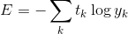

# 신경망 학습
이제 본격적으로 훈련 데이터를 통해 가중치 매개변수의 최적값을 학습하는 신경망 학습을 배워보자.

직선으로 분리 가능한(선형 분리 가능) 문제들은 모두 유한 번의 학습을 통해 풀 수 있다는 사실이 퍼셉트론 수렴 정리(Perceptron convergence theorem)를 통해 증명되었다.

다만 비선형 분리 문제는 자동으로 학습하는 것이 불가능하다.

## 데이터 주도 학습 - 기계학습과 딥러닝
기계학습은 사람이 밑바닥부터 알고리즘을 설계하는 것이 아니라, 주어진 데이터로부터 프로그램이 자동적으로 특징(feature)을 추출하고 그 특징의 패턴을 학습하는 기술이다.

여기서 말하는 특징은 입력 데이터에서 본질적이고 중요한 데이터를 정확하게 추출할 수 있도록 설계된 변환기를 가르킨다.

이미지의 특징은 보통 벡터로 기술하고, 컴퓨터 비전 분야에서는 SIFT, SURF, HOG 등의 특징을 많이 사용한다. 이러한 특징을 사용하여 이미지 데이터를 벡터로 변환하고, 변환된 벡터를 가지고 SVM, KNN 등의 기계학습을 수행할 수 있다.

여태까지의 기계학습 분야에서, 이러한 벡터, 즉 특징으로부터 패턴을 찾아내는 것은 기계가 해주지만 이미지를 벡터로 변환하는 과정은 여전히 사람이 설계해야 했다.

이 말은, 문제에 적합한 특징(벡터로 나타나는)을 쓰지 않으면 좋은 결과를 얻기 힘들다는 것이다.

그러나 신경망을 활용하면 기계는 이미지를 이미지 그대로 학습한다. 기계에게 이미지 속 특징을 세세히 알려줄 필요가 없는 것이다.

이러한 특징 때문에 딥러닝을 종단간 기계학습(end-to-end machine learning)이라고 부르기도 한다.

### 오버피팅 문제
딥러닝은 기계가 데이터를 입력받아 그대로 학습하며 스스로 그 특징을 찾아내는 방법이다.

이러한 특징 때문에 얘기치 못한 오류가 발생하기도 하는데 오버피팅이 대표적인 예다.

한가지 데이터셋, 적은 데이터셋을 반복적으로 학습한 결과 기계가 데이터에 일종의 편견을 가지게 되는 것으로, 오버피팅 문제가 발생한 신경망은 학습에 사용된 데이터는 귀신같은 정확도로 예측을 수행하지만, 새로운 데이터에 대한 정확도가 매우 낮아지는 문제를 갖는다.

## 손실 함수
신경망 학습에서는 현재의 상태를 하나의 지표로 나타낸다. 그리고 이 지표가 최적의 값이 되는 방향을 향해 가중치와 편향을 자동으로 수정하며 학습을 반복하는 것이다.

이러한 지표를 만들어주는 함수를 손실 함수(loss function)라 한다.

손실 함수로는 일반적으로 평균 제곱 오차와 교차 엔트로피 오차를 활용한다.

이 함수를 통해 학습을 통해 예측한 값과 실측값 사이의 오차를 계산하여, 오차를 최소화하는 방향으로 스스로를 학습시키는 것이다.

### 평균 제곱 오차
평균 제곱 오차(Mean squared error, MSE)는 가장 보편적으로 쓰이는 손실 함수 중 하나이다.

여기서 y는 신경망의 출력(예측값), t는 정답 레이블, k는 데이터의 차원 수를 나타낸다.

예시를 보자. 아래는 MNIST 이미지에 대해 신경망이 예측한 값을 softmax함수로 확률 형태로 나타낸 값이다.

~~~python
y = [0.1, 0.05, 0.6, 0.0, 0.05, 0.1, 0.0, 0.1, 0.0, 0.0]
t = [0, 0, 1, 0, 0, 0, 0, 0, 0, 0]
~~~
신경망이 정답을 맞췄지만, 완벽하지는 못하다. 이를 평균 제곱 오차 함수로 돌리면 아래 손실값이 나온다.
~~~python
0.0975
~~~
반면, 신경망이 정답 근처에도 못 갔다면 손실값은 더욱 큰 수가 나올 것이다.

### 교차 엔트로피 오차
또 다른 손실 함수로 교차 엔트로피 오차(Cross entropy error, CEE)가 있다.

이 식은 실질적으로 정답일 때의 추정(t가 1일때의 y)의 자연로그를 계산하는 식이 된다.(정답이 아니면 t가 0이므로 의미가 없다.)

예를 들어 정답 레이블은 2가 정답이라 하는데 신경망 출력이 0.6이면 E= -log(0.6) = 0.51이 된다.

같은 조건에서 신경망 출력이 0.1이라면 E=2.3이 되므로 손실값이 잘 계산되는 것을 알 수 있다.

즉, 교차 엔트로피 오차는 정답일 때의 출력이 전체 값을 결정하게 되는 것이다.

### 여담
나는 개인적으로 손실 함수에 오차라는 용어보다는 함수라는 용어를 사용하는 것을 선호하는 편이다.
예를 들어, 교차 엔트로피 오차 대신 교차 엔트로피 함수라는 식으로 말이다.

이렇게 하는 편이 일관성있고 이해하기 편하다. 오차와 손실값이 약간 거리가 있는 개념이기도 하고..

아니면 차라리 교차 엔트로피 오차 함수 라는 표현을 쓰면 좋겠지만 너무 길다.
다만 이 리포지토리에서는 Deeplearning from Scratch 책의 원래 표현을 존중하여 오차라는 용어를 사용하려고 한다.

실제로 필드에서도 MSF와 MSE 양쪽 표현 모두 사용하는 편이므로 둘 다 알아두자.